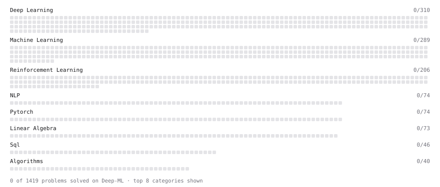

# Deep-ML

My machine learning practice from [Deep-ML](https://www.deep-ml.com). Every solution here was written by hand.

**2** solved · 0 problems · 0 labs · 2 math

[**Browse the interactive portfolio**](https://samirresque.github.io/deep-ml/) to replay this filling in over time.

## Math

| | Difficulty | Solved | |
| --- | --- | --- | --- |
| [Derivatives and Gradients](https://www.deep-ml.com/math-problems/1) | easy | 2026-09-17 | [solution](math/0001-derivatives-and-gradients) |
| [ML Workflow Basics](https://www.deep-ml.com/math-problems/30) | easy | 2026-08-13 | [solution](math/0030-ml-workflow-basics) |

---

_This file is regenerated by Deep-ML on every push._
